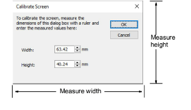

# Calibrating the monitor

You need to calibrate your monitor so that designs at 1:1 scale appear at real size. Do this when you first install EmbroideryStudio or whenever you change your monitor.

## To calibrate the monitor...

1. Select Setup > Calibrate Screen.

2. Measure the height and width of the dialog box.

3. Enter the measurement in the Width and Height fields.

4. Click OK.

## Related topics...

- [Viewing Designs](../../Basics/view/Viewing_Designs)
