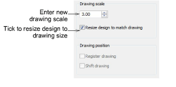

# Change drawing scales

You can change drawing scale during digitizing. When you change scale, EmbroideryStudio automatically resizes object outlines and regenerates the stitches.

## To change the drawing scale...

1. Select Setup > Tablet Setup.

2. Enter the new drawing scale. To calculate the scale, divide the height the enlargement drawing by the required height of the final embroidery. Enlargement drawings are generally prepared at a scale of 3.00.

3. Tick the Resize Design to Match Drawing checkbox.

4. Tick the Register Drawing checkbox.

5. Click OK.

6. Digitize the origin and the rotation reference points to re-register at the new size. The design is resized to the new scale.
