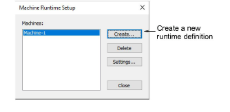
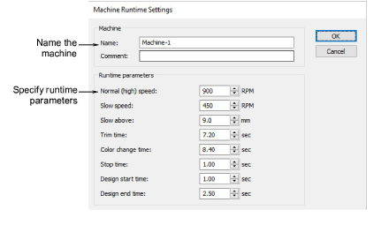
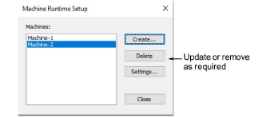

# Configure machine runtime settings

You can set up multiple named machines for the purposes of runtime analysis with specific parameters such as ‘fast speed’, ‘slow speed’, ‘trim time’, ‘color change time’, etc.

## To configure machine runtime settings...

1Select Setup > Machine Runtime Setup. Or run the command from the Design Information > Runtime tab. The Machine Runtime Setup dialog opens. The dialog lists all machines currently defined for the purposes of runtime analysis.

2Click Create to set up a new runtime definition. The Machine Runtime Settings dialog opens.

3Use the Name and Comment fields to uniquely identify the machine or machine class.

The class may be based on machine model. However different machines of the same model may be set up for different purposes – e.g. to run at different speeds. If so, you’ll need to set up different classes to suit.

Note: Machine types set up here are independent of machines defined in Connection Manager Setup or Embroidery Machine Connection dialogs.

4Create a runtime definition for the machine. Parameters are based on machine specs, controller feedback, and/or empirical observation:

| Option              | Function                                                                                                                                                                                                           |
| ------------------- | ------------------------------------------------------------------------------------------------------------------------------------------------------------------------------------------------------------------ |
| Normal (high) speed | The speed at which the machine normally sews. Normally available from machine specs.                                                                                                                               |
| Slow speed          | The slowest speed at which the machine runs. Normally available from machine specs.                                                                                                                                |
| Slow above          | The length of stitch above which the machine slows down. This value is automatically adjusted according to speed settings, in particular slow speed. Should be available from the machine specs.                   |
| Trim time           | The time the machine takes to perform a trim. May be available from machine specs or empirical observation.                                                                                                        |
| Color change time   | Same as for trim time.                                                                                                                                                                                             |
| Stop time           | Time spent stopping in order to place fabric, foam, etc. This is normally determined through empirical observation. The number of heads on the machine will be a determining factor – e.g. 16 heads x 6 secs each. |
| Design start time   | Time the machine takes to go from stop to normal speed – e.g. it may stitch a number of slow stitches to start off. May be available from machine specs or empirical observation.                                  |
| Design end time     | Stopping time – the machine may slow down and then travel to the center of the hoop before actually stopping.                                                                                                      |

5Click OK. All machines or machine classes you define are listed in the Machine Runtime Setup dialog. From here they can be updated or removed from the system.

