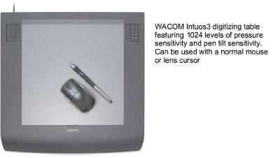

# Connecting digitizing tablets

You can use a digitizing tablet and puck with EmbroideryStudio as an alternative to digitizing directly on-screen. To use a tablet, you place an enlargement drawing on the active area, and use the puck to mark reference points.

Caution: EmbroideryStudio cannot use the MS Windows®-compatible drivers of some tablets – e.g. GTCO and Calcomp tablets. Earlier versions of WinTab do not free up the COM port, even when it is not in use. This means EmbroideryStudio is unable to communicate with the digitizing tablet. Check with the tablet manufacturer to obtain a version of tablet software which will free the port when not in use. Alternatively, the software may disable or uninstall WinTab, or use another COM port when working with EmbroideryStudio.

## Related topics...

- [Set up digitizing tablets](Set_up_digitizing_tablets)
- [Customize digitizing tablet formats](Customize_digitizing_tablet_formats)
- [Prepare enlargement drawings](Prepare_enlargement_drawings)
- [Register enlargement drawings](Register_enlargement_drawings)
- [Change drawing scales](Change_drawing_scales)
- [Shift enlargement drawings](Shift_enlargement_drawings)
- [Use digitizing pucks](Use_digitizing_pucks)
