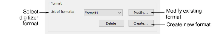
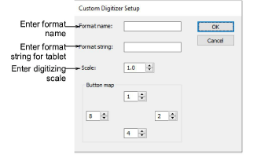

# Customize digitizing tablet formats

If the digitizing tablet format you require is not preset in EmbroideryStudio, you can create a new format, or modify an existing format to match the output of your tablet. Before starting, review the digitizing tablet documentation.

Caution: This functionality is provided for advanced users with knowledge of the data protocols supported by their digitizing tablet. Only use it if your digitizing tablet does not work with any existing formats.

## To customize a digitizing tablet format...

1. Access the Digitizer Setup dialog.

2. In the Format panel:

- To modify an existing format, select the format and click Modify.
- To define a new format, click Create. The Custom Digitizer Setup dialog opens.

3. In the Format Name field, enter a name for the new or modified format.

4. In the Format String field, enter the format string your digitizing tablet outputs.

Obtain this information from the digitizing tablet documentation.

5. In the Scale field, enter the scale at which you are digitizing. For example, a scale of 3.0 means your on-screen design will be one third the size you digitize on the tablet.

6. Click OK.

## Related topics...

- [Set up digitizing tablets](Set_up_digitizing_tablets)
