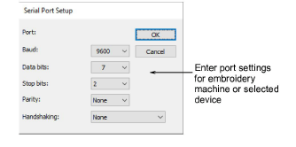

# Enter serial port settings

|  | Use Legacy Features > Hardware Setup to set up a machine connection with name, port, and protocol. |
| -------------------------------------------------------- | -------------------------------------------------------------------------------------------------- |

PC serial COM ports are male connectors, and can be either 9-pin or 25-pin. They are named COM1, COM2, COM3, etc. When you set up a digitizer or machine that is connected via a serial port, you need to enter the serial port settings in EmbroideryStudio.

Note: You must be able to identify the ports on your computer. If in doubt, consult a PC technician.

## To enter serial port settings...

1Select Legacy Features > Hardware Setup.

2Select a device from the Type list and select an item in the Name column, then click Settings. The &lt;Device&gt; Setup dialog opens.

3In the Connected To panel, select a serial port from the Port list.

4Click Setup. The Serial Port Setup dialog opens.

5Enter the Baud rate, Data Bits, Stop Bits and Parity and Handshaking settings for the device.

6Click OK.

Note: The port settings must match those of the embroidery machine or selected device. The type of handshaking must match the type of cable you are using. Check the communications setup section of the documentation that came with the device.

## Related topics...

- [Connecting digitizing tablets](Connecting_digitizing_tablets)
- [Serial ports](Peripheral_device_connections)
