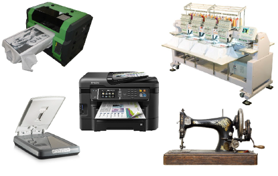

# Hardware Settings

You will need to connect peripheral devices for use with EmbroideryStudio. These may include digitizing tablets, plotters, printers, [appliqué](../../glossary/glossary) cutters, scanners and embroidery machines. Different devices are set up in different ways – some in MS Windows®, via the Control Panel, others within EmbroideryStudio itself.

EmbroideryStudio provides alternate means for sending designs directly to machine. Depending on your hardware, you can send designs directly using Stitch Manager, Machine Manager, or Connection Manager. Machine Manager is described in a separate Supplement.

Tip: The number of available ports limits the number of devices you can connect. If additional ports are required, you can add them. Multi-port serial cards can also be used. See a PC technician about your requirements.

## Related topics...

- [Calibrating the monitor](Calibrating_the_monitor)
- [Peripheral device connections](Peripheral_device_connections)
- [Setting up machines for Connection Manager](Setting_up_machines_for_Connection_Manager)
- [Setting up machines for Stitch Manager](Setting_up_machines_for_Stitch_Manager)
- [Doing runtime estimates](Doing_runtime_estimates)
- [Setting up scanners](Setting_up_scanners)
- [Connecting digitizing tablets](Connecting_digitizing_tablets)
