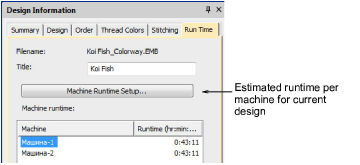
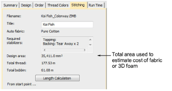
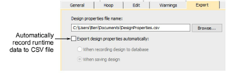
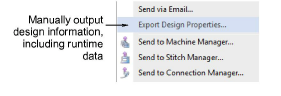

# Output design information to CSV

|  | Use Docker > Design Information to view and modify design details prior to design approval or stitchout. |
| ---------------------------------------------------- | -------------------------------------------------------------------------------------------------------- |

Design information, including runtime estimates and relevant parameters, can be output to CSV file for later use by third-party applications. New data is appended to the file.

## Estimated running times

Once your machines or machine classes have been defined, estimated running time for a specific embroidery file is displayed in the Design Information > Runtime tab. This tab lists available machines together with estimated runtimes for the current design.

## Related topics...

- [Runtime tab](../../Management/manage_designs/Runtime_tab)

## Cost of fabric parameters

An Design Area field on the Stitching tab shows the total design area. It is calculated by multiplying design width and height, not actual stitched area. This figure is used to estimate the cost of fabric or 3D foam that can be used in the design.

## Export options

Design information can be written whenever the design is saved or recorded to DesignWorkflow database. An Options > Export tab allows you to preset these options.

## Manual export

The File > Export Design Information command allows you to output current design information and machine runtime settings to CSV file.

The CSV output file includes the following fields. The first group derives from the Design Information > Design and Stitching tabs. The second group derives from Machine Runtime Settings.

| Field                     | Description                                                                                                                                                                                     |
| ------------------------- | ----------------------------------------------------------------------------------------------------------------------------------------------------------------------------------------------- |
| Date                      | Date and time of exporting properties.                                                                                                                                                          |
| Design data               | Derived from design tab                                                                                                                                                                         |
| File name                 | Name design saved under.                                                                                                                                                                        |
| Machine format            | Machine format of design.                                                                                                                                                                       |
| Stitches                  | Total number of stitches in design.                                                                                                                                                             |
| Colors                    | Total number of thread colors in design.                                                                                                                                                        |
| Color changes             | Total color changes – may or may not coincide with number of colors.                                                                                                                            |
| Stops                     | Number of machine stops in design.                                                                                                                                                              |
| Trims                     | Number of trims in design.                                                                                                                                                                      |
| Sequins                   | Number of sequins in design.                                                                                                                                                                    |
| Bling                     | Number of individual rhinestones in design.                                                                                                                                                     |
| Height (mm)               | Height of sewing area - derived from design extents.                                                                                                                                            |
| Width (mm)                | Width of sewing area - derived from design extents.                                                                                                                                             |
| Stitching data            | Derived from stitching tab                                                                                                                                                                      |
| Total thread (m)          | Total length of thread used in design.                                                                                                                                                          |
| Design area (mm²)         | Area covered by design - calculated according to design extents.                                                                                                                                |
| Runtime data              | Derived from runtime settings tab                                                                                                                                                               |
| Below / Above             | Number of stitches stitched at slow and high speed according to ’slow above’ parameter. Combined numbers should equate to ’Stitches’ value.                                                     |
| Machine                   | Machine as shown on Machine Runtime Setup dialog. If there are multiple machines defined, a separate line entry appears for each.                                                               |
| Normal (high) speed (RPM) | Runtime setting as shown on Machine Runtime Settings dialog.                                                                                                                                    |
| Slow speed (RPM)          | Ditto                                                                                                                                                                                           |
| Slow above (mm)           | Ditto                                                                                                                                                                                           |
| Trim time (sec)           | Ditto                                                                                                                                                                                           |
| Color change time (sec)   | Ditto                                                                                                                                                                                           |
| Stop time (sec)           | Ditto                                                                                                                                                                                           |
| Design start time (sec)   | Ditto                                                                                                                                                                                           |
| Design end time (sec)     | Ditto                                                                                                                                                                                           |
| Runtime (min:sec)         | Calculated runtime of this design according to particular machine as shown on Design Information > Runtime tab. If there are multiple machines defined, a separate line entry appears for each. |

## Related topics...

- [Viewing design information](../../Basics/view/Viewing_design_information)
