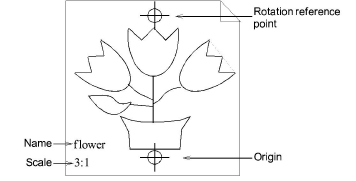

# Prepare enlargement drawings

When you digitize with a tablet, you use an enlargement drawing to trace the shapes and outlines of the design in the same way you use [backdrops](../../glossary/glossary) on-screen. Before you start, you need to prepare the enlargement drawing.

## To prepare an enlargement drawing...

1Convert the [artwork](../../glossary/glossary) to a technical drawing.

Generally the drawing will be three times larger than the final embroidery.

Tip: If the drawing is in hard copy, scale it using a transparency projector or photocopier. If you used a graphics application to create the artwork, scale it before you print it out.

2Modify the drawing to make it suitable for embroidery:

- Define shapes that can be easily filled with stitches.
- Overlap and distort shapes to compensate for [push-pull](../../glossary/glossary).
- Draw digitizing guidelines – e.g. stitch angle lines.

3Draw origin and rotation reference points.

These points set the position and orientation of the enlargement drawing on the digitizing tablet.

Tip: If the drawing is bigger than the digitizing tablet, enter additional points to help you shift the drawing as you digitize.

4Write the name and scale of the enlargement drawing for future reference.

## Related topics...

- [Shift enlargement drawings](Shift_enlargement_drawings)
