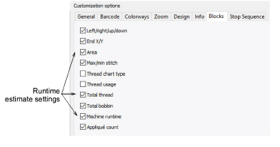

# Print runtime estimates

The Production Worksheet prints runtime information. Three fields pertaining to the information appear under the Blocks tab – ‘Area’, ‘Total thread’ and ‘Machine runtime’.

The Machine runtime checkbox is only available if the feature is available in the software. If there are no machines set up, checking ‘Machine runtime’ has no effect as there is nothing to print. Total thread prints the information of the same name in the Design Information docker. This information is included in both Production Worksheet and Production Summary.

## Related topics...

- [Viewing design information](../../Basics/view/Viewing_design_information)
- [Customizing design reports](../../Production/reports/Customizing_design_reports)
- [Printing design reports](../../Production/reports/Printing_design_reports)
