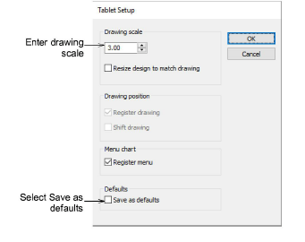
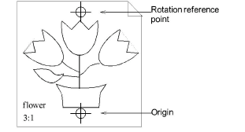

# Register enlargement drawings

When you place an enlargement drawing on the digitizing tablet, you need to register it so EmbroideryStudio can interpret the design. To register an enlargement drawing, enter the scale, and digitize the origin and rotation points on the tablet. The origin and rotation points should be marked on the enlargement drawing. If they are not, you need to draw them in.

## To register an enlargement drawing...

1Select Setup > Tablet Setup.

2In the Drawing Scale panel, enter the scale of the enlargement drawing. To calculate the scale, divide the height the enlargement drawing by the required height of the final embroidery. Enlargement drawings are generally prepared at a scale of 3.00.

3Tick the Save as defaults checkbox. This saves the registration information for this drawing so you do not have to re-register each time you resume digitizing.

4Click OK and place the enlargement drawing on the digitizing tablet.

5Click the origin and rotation points of the drawing with Button 1 of the digitizing puck. This completes the registration.

