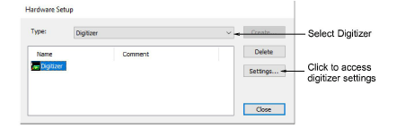
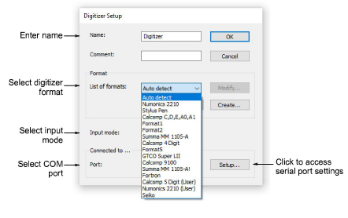

# Set up digitizing tablets

|  | Use Legacy Features > Hardware Setup to set up a machine connection with name, port, and protocol. |
| -------------------------------------------------------- | -------------------------------------------------------------------------------------------------- |

EmbroideryStudio can only support one tablet at a time. The format and the preferred pointer display mode must be specified.

## To set up a digitizing tablet...

1Connect the digitizing tablet and puck using the accompanying instructions, and run EmbroideryStudio.

2Select Legacy Features > Hardware Setup.

3From the Type list, select Digitizer.

4Click Settings. The Digitizer Setup dialog opens.

5Use the Name and Comment fields to uniquely identify the digitizing tablet.

6In the Format panel, select a digitizer format.

Select from standard digitizer formats or select Auto Detect to automatically match the format to the connected digitizer. Not all digitizers can be automatically detected by EmbroideryStudio. For these tablets, you can define a new format or modify existing format settings.

7From the Input Mode list, select Point or Stream.

This setting must be the same as the one you specified on the digitizing tablet:

| Mode   | Function                                                                                                                                 |
| ------ | ---------------------------------------------------------------------------------------------------------------------------------------- |
| Point  | In this mode, the pointer position on screen is only updated when you click a button on the puck.                                        |
| Stream | In this mode, the pointer position is continuously updated. When you move the digitizer puck on the tablet, the pointer moves on screen. |

8From the Port list, select the COM port to which the digitizer is connected.

Digitizing tablets generally connect to COM1 but can connect to any available serial COM port.

9Click Setup to access the serial port settings. These settings must be the same as those set on the digitizing tablet, or EmbroideryStudio will not be able to communicate with it.

Note: If you use Stream mode, you need to set the digitizer to transmit at 20 data packets per second or less. The baud rate for the digitizing tablet and serial port must both be set to 9600 baud.

Caution: To avoid loss of data at high speed, it is important to set up the tablet correctly. If it can only transmit at greater than 20 data packets per second, reduce the baud rate of the tablet from 9600 baud to 2400 baud.

10Click OK then Close.

## Related topics...

- [Customize digitizing tablet formats](Customize_digitizing_tablet_formats)
- [Serial ports](Peripheral_device_connections)
