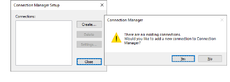
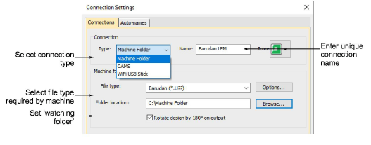
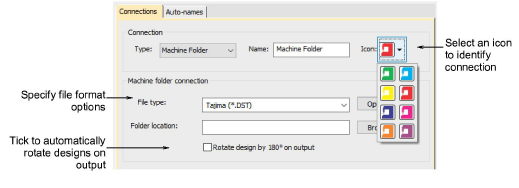
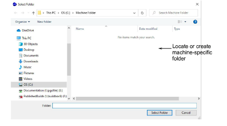
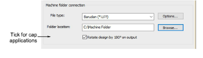
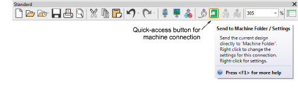
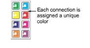
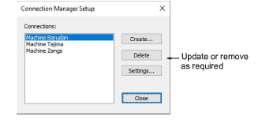

# Set up machines

|  | Use Standard > Send to Connection Manager to connect to supported machines via proprietary machine software. |
| ------------------------------------------------------------------ | ------------------------------------------------------------------------------------------------------------ |

EmbroideryStudio supports various machine models. Some can be connected by cable directly to your PC via USB port. Others require files to be placed in a specific network location or ‘watching folder’. Older-style machines do not support direct connection but they do read ATA PC cards and/or USB memory sticks. Connection Manager provides a method of connection to machines that appear as removable media or make use of third-party connection software. Once set up in EmbroideryStudio, a single click is sufficient to send the design to machine.

## To set up a machine...

1. Select Setup > Connection Manager Setup. Alternatively, click the Send to Connection Manager icon on the Standard toolbar. If no connections currently exist, a message appears.

2. Click Yes or Create to start setting up your connections. The Connection Settings dialog opens.

3. Select the connection type. Choose from:

- Machine folder – e.g. Barudan DFS, HappyLink/LAN, Brother PR series, etc
- Janome MB-4
- CAMS (rhinestone placement machine).

4. Enter a unique name for the connection. This identifies the quick-access button on Standard toolbar and appears in the tooltip.

5. Choose an icon to identify the specific connection.

6. Select the file type required by the machine. Depending on the chosen file type, the Options button may become available. This allows you to set up specific file format options from within Connection Manager without having to go to the Save As dialog.

7. Enter or browse to a folder location on the network or PC which has been set up for the specific machine.

For example, if you choose to connect to a Barudan LEM design server, this allows you to set up a ‘watching folder’ which the server monitors for design files (U?? format). It then systematically converts to PRJ for machine communication. When you output a design, Connection Manager saves it to this folder in the specified format.

8. Optionally, tick the checkbox to rotate designs by 180º on output for cap applications. If ticked, all designs sent to that connection will be automatically rotated.

9. Click OK when complete. The new connection appears on the Standard toolbar.

10. Repeat steps to set up more machine connections. As more machines are created, more quick-access buttons are added to the Standard toolbar. Each can be assigned its own identifying color.

All machines connections you define are listed in the Connection Manager Setup dialog. From here they can be updated or removed from the system.

## Related topics...

- [Save & close designs](../../Basics/basics/Save_close_designs)
- [Send designs to Connection Manager](../../Production/output/Send_designs_to_Connection_Manager)
- [Send bling to CAMS machine](../../Applied/export/Send_bling_to_CAMS_machine)
