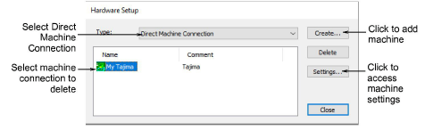
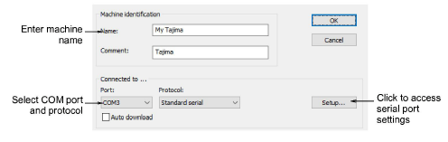
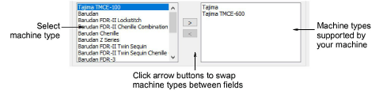
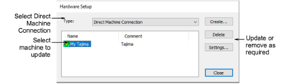

# Set up machines

|  | Use Legacy Features > Hardware Setup to set up a machine connection with name, port, and protocol. |
| ---------------------------------------------- | -------------------------------------------------------------------------------------------------- |

To set up a machine you need to define a name, the port it is attached to, and the protocol it uses. For every machine, you need to select the [machine format](../../glossary/glossary#machine-format) it supports.

## To set up machines...

1. Connect the embroidery machine using the instructions that came with the machine. Carefully note the port settings.

2. Run EmbroideryStudio. The port settings must now be entered in EmbroideryStudio Hardware Setup.

3. Select Legacy Features > Hardware Setup.

4. From the Type list, select Direct Machine Connection.

- To add a new machine, click Create.
- To change the settings of an existing machine, select it, then click Settings.

The Embroidery Machine Connection dialog opens.

5. Use the Name and Comment fields to uniquely identify the machine connection.

6. From the Port list, select the serial (COM) or parallel (LPT) port to which the machine is connected.

7. From the Protocol list, select the protocol for the connection between the computer and embroidery machine.

See the documentation supplied with the embroidery machine to determine the appropriate connection.

8. Click Setup to access the serial port settings.

These settings must be the same as those set on the embroidery machine, or EmbroideryStudio will not be able to communicate with it.

9. Select Auto Download to directly download designs to the assigned machine. Deselect it to confirm before sending.

10. In the Machine Type panel, select the compatible [machine formats](../../glossary/glossary).

To do this, select compatible machine types in the Available list, and click > to move them to the For this machine list.

::: info Note
Machine format values can be added or changed if required.
:::

11. Click OK to return to the Hardware Setup dialog.

12. Click Close. All machine connections you define are listed in the Hardware Setup dialog. From here they can be updated or removed from the system.

::: info Note
Once machine setup is complete, you can stitch out a design via Stitch Manager without changing the original design format.
:::

## Related topics...

- [Peripheral device connections](Peripheral_device_connections)
- [Serial ports](Peripheral_device_connections)
- [Send designs to Stitch Manager](../../Production/output/Send_designs_to_Stitch_Manager)
- [Custom machine formats](../machines/Custom_machine_formats)
