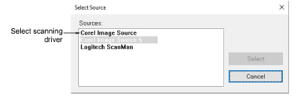

# Setting up scanners

EmbroideryStudio supports [WIA](../../glossary/glossary)\-compatible scanners. Some scanners will not work with EmbroideryStudio because they require their own scanner software. If this is the case with your scanner, use your scanner software for scanning, save the image to your hard drive, then load the image into EmbroideryStudio.

## To set up scanners...

1Connect the scanner using the accompanying instructions.

2Set it up in MS Windows® using the accompanying instructions and/or the Microsoft MS Windows® documentation.

3Start EmbroideryStudio.

4Select Setup > Scanner Setup. The Select Source dialog opens displaying a list of scanner drivers loaded on your computer.

5Select the scanning driver to use, then click Select.

Note: If you have trouble with scanning after re-starting EmbroideryStudio, there may be a conflict with previously installed scanner drivers. Re-install EmbroideryStudio and test the scanner. If the selected scanner driver does not work in EmbroideryStudio, select another scanner driver from the list. There are usually two installed for each scanner.
