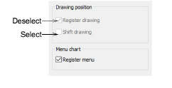
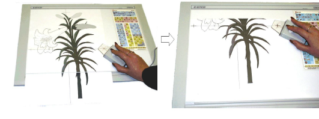

# Shift enlargement drawings

If the drawing is bigger than the digitizing tablet, you can move it across the tablet and continue digitizing. To move a drawing you need to draw, and digitize, two additional reference points.

## To shift an enlargement drawing...

1Draw additional reference points on the enlargement drawing.

Position the points so that they will be on the active part of the digitizing tablet both before and after the move.

Tip: If you are shifting the drawing up or down, draw the additional reference points horizontally. If you are shifting left or right, draw them vertically.

2Select Setup > Tablet Setup.

3Tick the Shift Drawing checkbox.

4Untick the Register Drawing checkbox and click OK.

5Click the additional reference points with Button 1 on the digitizing puck.

6Move the drawing so that the part you want to digitize next is over the active area of the digitizing tablet, and click the additional reference points again. The drawing is re-registered in the new position.
