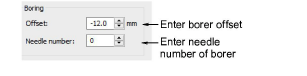

# Borer functions

Some embroidery machines are equipped with a borer. The borer often replaces one of the needles. You need to specify the needle position of the borer and its offset value. Borers are often ‘knife’ attachments where the cutting position is offset ±12 mm from the main needle. Before the machine starts, the frame moves so that the borer is in the correct position. This extra frame movement compensates for the borer offset. Some machines automatically adjust for this offset when a Borer In function is encountered. These machines should have an offset value of 0\. Similarly, if you are using a boring needle (instead of a knife), you do not need an offset value. See your machine manual for details.

## To set borer functions...

1Open a design.

2Access the Machine Format Settings > Standard dialog. Only fields relevant to the selected machine format will appear.

3In the Boring panel, enter the required borer offset.

- If your machine automatically inserts an offset when a Borer In function is encountered, enter an offset of 0 mm.
- If your machine requires an offset value, enter an offset of ±12.0 mm.

4Enter the needle number to which the borer is attached.

5Click Save then Close.

## Related topics...

- [Embroidery machine formats](../../Basics/basics/Embroidery_machine_formats)
- [Boring](../../Applied/mixed/Boring)
