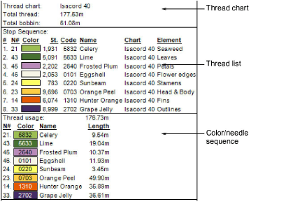
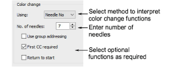

# Color-change functions

Machines interpret Color Change functions differently – either as a Needle Number or Stop function. Basically, the following rules apply:

- Single-needle machines simply stop when a Color Change or Stop function is encountered.
- Some multi-needle machines default to the next color without stopping.
- Some multi-needle machines support direct needle addressing.

## Stop functions

Stop functions allow the operator to manually change threads. They are generally used with machines that only have one needle. Stop functions are sometimes combined with Jump functions to indicate color changes.

## Color-change functions

For those machines that support them, Color Change functions tell the machine to move to the next needle whenever a CC function is encountered. The machine must have the correct thread colors loaded according to the production worksheet.

## Needle-number functions

For needle addressing machines, each color ‘slot’ on the color palette corresponds to a needle number. Needle Number functions are sometimes combined with Jump functions to indicate color changes.

For needle addressing machines, you need to specify how many needles are on the machine. This tells the machine how often it needs to stop for the operator to change threads. For example, for a design with 15 colors to be stitched out on a machine with five needles, it must stop after every three color changes in order for the operator to change threads.

## To set color change functions...

1Open a design.

2Access the Machine Format Settings > Standard dialog. Only fields relevant to the selected machine format will appear.

3In the Color Change panel, select a method for interpreting color-change functions:

| Method            | Converts color-change functions to... |
| ----------------- | ------------------------------------- |
| Needle no         | Needle Number functions               |
| Stops             | Stop functions                        |
| Stop & jump       | Stop and Jump functions               |
| Needle no & jumps | Needle Number and Jump functions      |

4For needle-addressing machines, enter the number of needles on the machine in the No of Needles field.

5Optionally, select the Use Group Addressing checkbox.

Some machines can group two heads together so you can stitch a design using needles from both heads. For example, if a machine has two heads and nine needles per head, the machine moves the hoop from the first head under the second head, which allows you to stitch 18 colors without a manual change.

Note: If this is the case, enter the combined number of needles on the machine in the No of Needles field.

6Optionally, select the First CC required checkbox.

Some machines require a First CC code to initialize the machine and bring the head back to the first color change needle position.

7Optionally, select the Return to Start checkbox.

This returns the needle to the start of design, preparing the machine for the repeat run.

8Click Save then Close.

## Related topics...

- [Embroidery machine formats](../../Basics/basics/Embroidery_machine_formats)
