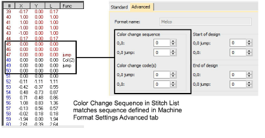

# Color-change sequence

Some machines cannot interpret color-change functions unless they form part of a ‘color change sequence’ made up of [empty stitches](../../glossary/glossary) and [empty jumps](../../glossary/glossary) before and after each color change. Check your machine requirements to determine whether you need to enter color-change sequence values.

In the Advanced tab, the Color Change Sequence panel reads from top to bottom, in the order the codes appear in the sequence. The first two fields show the number of empty stitches and empty jumps to insert before the color change. The other fields show the empty jumps and empty stitches to insert after the function.

## Related topics...

- [Embroidery machine formats](../../Basics/basics/Embroidery_machine_formats)
