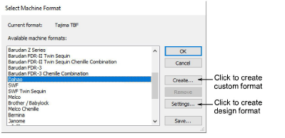
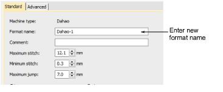

# Custom machine formats

EmbroideryStudio provides standard formats for most machines. However, if your machine is different, you may need to customize the machine format settings. For example, if you have different models of the same type of embroidery machine, different functions may require different values.

## Creating custom formats

You can create a new machine format based on a standard machine format, and make it available to all designs.

- In the Format Name field, enter a name for the new format – e.g. Melco-1.
- In the Comment field, enter any information that will help you identify the machine format – e.g. No Trim.
- Adjust Standard and Advanced machine format settings as needed.

## Creating design-specific formats

You can create a custom machine format for use with the current design. You cannot change the Name or Comment fields. The custom machine format is automatically named using the original machine format and design name – e.g. Melco-Design1.

Note: If necessary, you can update the standard machine format itself. However, you should only do this if the original values are no longer used.

## Related topics...

- [Embroidery machine formats](../../Basics/basics/Embroidery_machine_formats)
- [Standard machine formats](Standard_machine_formats)
- [Advanced machine formats](Advanced_machine_formats)
