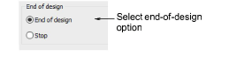

# End-of-design functions

Some machines require an explicit End of Design function code in order to recognize when the end of the design has been reached. Some machines do not understand the End of Design function code, requiring a Stop code instead. For example, Tajima machines recognize the explicit End of Design function code while Happy machines require a simple Stop.

## To set end-of-design functions...

1. Open a design.

2. Access the Machine Format Settings > Standard dialog. Only fields relevant to the selected machine format will appear.

3. In the End of Design panel, select the appropriate option for your machine:

| Option        | Function                                                                                   |
| ------------- | ------------------------------------------------------------------------------------------ |
| End of design | Some machines require an explicit End of Design function code – e.g. some Tajima machines. |
| Stop          | Some machines require a Stop code instead – e.g. Happy machines.                           |

4. Click Save then Close.

## Related topics...

- [Embroidery machine formats](../../Basics/basics/Embroidery_machine_formats)
- [Start/end-of-design sequence](Start_end-of-design_sequence)
