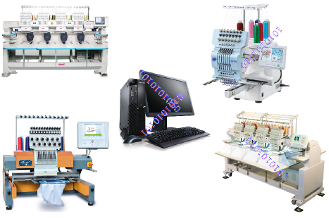

# Machine Formats

Different embroidery machines speak different languages. They have their own control commands for [machine functions](../../glossary/glossary). Before you can stitch a design, it must be in a format which can be understood by the machine. When you select a machine format, EmbroideryStudio uses it to translate digitized designs into a specific machine-readable form. If required, you can customize machine formats to meet specific machine requirements.

## Related topics...

- [Standard machine formats](Standard_machine_formats)
- [Advanced machine formats](Advanced_machine_formats)
- [Custom machine formats](Custom_machine_formats)
