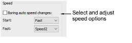

# Speed options

Some machines can stitch at different speeds. Depending on your machine, you may then be able to select different speeds to use when you start stitching or for when the borer is engaged.

Where available, the Boring Auto Speed Changes option in the Advanced tab slows the machine automatically whenever the borer is engaged. From the Start list, select the preferred starting speed – Fast or Slow. From the Fast list, select the faster setting on your machine – Speed 1 or Speed 2. Check your machine manual for details.

## Related topics...

- [Embroidery machine formats](../../Basics/basics/Embroidery_machine_formats)
