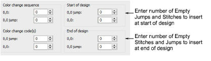
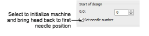
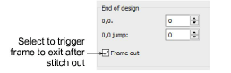

# Start/end-of-design sequence

In addition to an End of Design function, some machines require extra [empty stitches](../../glossary/glossary) and [empty jumps](../../glossary/glossary) in order to stitch the start and end of a design. Other machines require a Stop function. Depending on the machine type, you may also require functions to initialize the machine or trigger a [frame-out](../../glossary/glossary) after stitching.

Where available, the Set Needle Number option initializes the machine and brings the head back to the first color change needle position.

Where available, the Frame Out option triggers the frame to exit after stitching the design.

Note: Remember that these fields show the number of extra codes you want to insert in addition to [default settings](../../glossary/glossary).

## Related topics...

- [Embroidery machine formats](../../Basics/basics/Embroidery_machine_formats)
