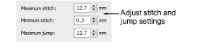

# Stitch & jump length settings

With most machines you can set maximum frame movement, [minimum stitch length](../../glossary/glossary) to recognize, and automatic jump length.

## To set stitch and jump length...

1. Open a design.

2. Access the Machine Format Settings > Standard dialog. Only fields relevant to the selected machine format will appear.

3. In the Maximum Stitch field, enter the maximum stitch length to allow.

The value you enter depends on the tape code used by your machine:

- Binary coding system: 12.7 mm – e.g. Barudan machines
- Ternary coding system: 12.1 mm – e.g. Tajima machines.

4. In the Minimum Stitch field, enter the minimum stitch length to allow.

This sets the default Small Stitches value. Generally the minimum stitch length is increased for dense materials and thick threads to prevent thread breakage.

5. In the Maximum Jump field, enter the maximum jump length to allow.

This sets the default Auto Jump value. Shorter jump values generally improve stitch quality and reduce wear on the machine but may increase stitch-out time.

6. Click Save then Close.

## Related topics...

- [Embroidery machine formats](../../Basics/basics/Embroidery_machine_formats)
- [Eliminating small stitches](../../Quality/quality/Eliminating_small_stitches)
