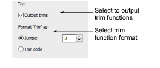

# Trim functions

With some machine formats you can specify how to format and interpret trim functions. Some machines understand specific trim codes. Others interpret multiple jumps as a trim function. Machines without an automatic trimmer may not know how to interpret trim functions, and may even shift the design when a trim code is encountered. For these machines you need to deselect the Output Trims checkbox so that trim functions are ignored when the design is stitched.

## To set trim functions...

1. Open a design.

2. Access the Machine Format Settings > Standard dialog. Only fields relevant to the selected machine format will appear.

3. In the Trim panel, select the Output Trims checkbox to include trim functions when outputting to the selected machine.

If you deselect the checkbox, trim functions are not removed from the design but simply ignored during output.

4. Specify the trim format to use:

| Option    | Function                                                                                     |
| --------- | -------------------------------------------------------------------------------------------- |
| Jumps     | Use for machines that interpret multiple jumps as trims. Enter the required number of jumps. |
| Trim code | For machines that interpret explicit trim commands.                                          |

5. Click Save then Close.

## Related topics...

- [Embroidery machine formats](../../Basics/basics/Embroidery_machine_formats)
