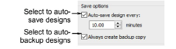

# Automatic save & backup options

|  | Use Standard > Options to access application options for design view, grid & guides, and other settings. |
| ---------------------------------- | -------------------------------------------------------------------------------------------------------- |

Save your work automatically at regular intervals using Auto Save. This protects you in the event of hardware or software failure.

## Auto save

The Auto Save function creates a temporary file with the extension EMA in the RECOVER folder. This is automatically restored when EmbroideryStudio is restarted after a computer crash. You can access these files manually by browsing to the RECOVER folder and renaming files from EMA to EMB.

## Backup copy

If the Backup Copy checkbox is ticked, a backup copy of the current design file is automatically created in its previously saved form. This protects you from overwriting the design with unintended changes – e.g. using the Save option instead of Save As to save a modified design. The backup copy is saved in the BACKUP folder with the original file name and native file format. Access backup files manually by browsing to the BACKUP folder.

Caution: Backup files remain in the BACKUP folder until you delete them. To prevent the folder from using too much hard disk space, delete unwanted files regularly. Backup files should be kept in a separate physical location, preferably off-site. Access the backup folder via the File > Open Backup Design command.

## Related topics...

- [Custom asset locations](../../Management/manage%5Fassets/Custom%5Fasset%5Flocations#XREF%5F78115%5FCustom%5Fasset)
