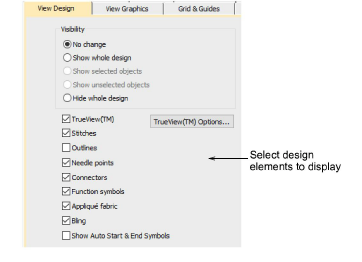
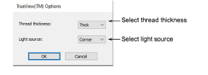
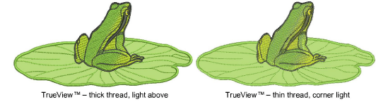

# Design viewing options

|  | Use Standard > Options to access application options for design view, grid & guides, and other settings. |
| -------------------------------------------- | -------------------------------------------------------------------------------------------------------- |

EmbroideryStudio lets you preset options to show or hide design elements such as stitches, outlines, and background fabric. You can also change TrueView™ settings for different viewing effects.

## To set design viewing options...

- Click the Options icon or select Setup > Options and select the View Design tab.

- Select viewing options to display. These control the same toggles as the View toolbar. The difference is that the selections you make here affect default system settings.
- Click TrueView Options to adjust TrueView™ settings.

- Adjust thread thickness and light source for preferred TrueView™ appearance. These settings also affect the appearance of printed TrueView™ ‘virtual decoration’.

Note: This Thread Thickness setting only affects the TrueView™ display, not actual thread thickness values.

## Related topics...

- [View embroidery components](../../Basics/view/View_embroidery_components)
- [Viewing design components](../../Basics/view/Viewing_design_components)
- [Outputting designs as images](../../Production/reports/Outputting_designs_as_images)
