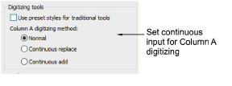

# Digitizing presets

|  | Use Standard > Options to access application options for digitizing tools. |
| -------------------------------------------- | -------------------------------------------------------------------------- |

The Continuous Input setting provides a simple and efficient way of digitizing a single [Column A](../../glossary/glossary) object comprised of separately stitched sections.

Five preset styles are included for use with the ‘Use preset styles for traditional tools’ option. These apply to the Column A, Column B, Column C, Complex Fill, and Complex Turning tools. When the option is checked, default stitch type and underlay conform to the associated style. If you change stitch type or underlay, this applies throughout the current session. When the checkbox is unticked, current settings are used.

| Traditional tool     | Cover  | Underlay 1 | Underlay 2 |
| -------------------- | ------ | ---------- | ---------- |
| Column A/B/C         | Satin  | Edge run   | Zigzag     |
| Complex/Turning fill | Tatami | Edge run   | Tatami     |

## Related topics...

- [Embroidery digitizing](../../Digitizing/input/Embroidery_digitizing)
- [Create smooth joins](../../Digitizing/input/Create_smooth_joins)
- [Working with styles](../../Digitizing/properties/Working_with_styles)
