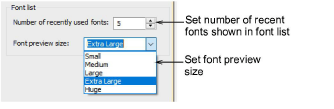

# Font list display options

|  | Use Standard > Options to access application options for design view, grid & guides, and other settings. |
| -------------------------------------------- | -------------------------------------------------------------------------------------------------------- |

You can set the size of your font preview via the Options > General tab. You can also adjust the number of recently used fonts.

## Related topics...

- [Select embroidery fonts](../../Lettering/lettering_create/Select_embroidery_fonts)
