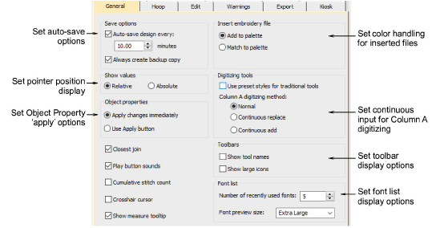

# General options

The General tab of the Options dialog provides a miscellaneous group of system settings including automatic save and backup, pointer position display, color handling for inserted files, paste position options, toolbar display, and others.

## Related topics...

- [Automatic save & backup options](Automatic_save_backup_options)
- [Pointer position display](Pointer_position_display)
- [Thread color handling for inserted files](Thread_color_handling_for_inserted_files)
- [Paste & duplicate options](Paste_duplicate_options)
- [Toolbar display options](Toolbar_display_options)
- [Object property apply options](Object_property_apply_options)
- [Other general options](Other_general_options)
