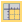
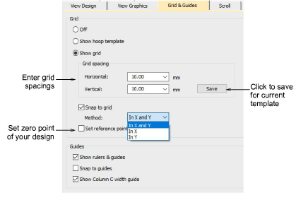
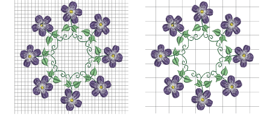
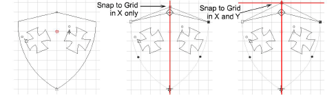

# Grid display options

|                        | Click View > Show Grid to show or hide the grid. Right-click for settings.                       |
| ---------------------------------------------------------- | ------------------------------------------------------------------------------------------------ |
|  | Click View > Show Rulers and Guides to show or hide rulers and guides. Right-click for settings. |
|            | Drag the Ruler Zero Point to reset a new ruler zero point.                                       |

Adjust grid spacing depending on the size of design you are working with. Use the Snap to Grid feature to align objects with the nearest grid lines. Checkboxes control the same toggles as the View toolbar. The difference is that the selections you make here affect default system settings next time you run EmbroideryStudio.

## To adjust grid display...

- Right-click Show Grid. The Options > Grid & Guides dialog opens.

- Enter Grid Spacing values for horizontal and vertical grid lines. To save grid spacing to the current template, click Save.

- Select the Snap to Grid checkbox as required. Reference points, control points or leading edges of objects snap to grid during digitizing, sizing, reshaping, or positioning operations.

- Choose a snap method. You can choose whether to activate in X or Y axes or both.
- Select the Set Reference Point checkbox to set the zero point of the rule. For example, you can set the grid reference point to the design center. This is easier and faster than moving the whole design. When you close the dialog, you are prompted to mark the zero point of your design.

::: tip
To temporarily disable Snap to Grid as you digitize, hold down Alt.
:::

## Related topics...

- [Display grids, rulers & guides](../../Basics/basics/Display_grids_rulers_guides)
