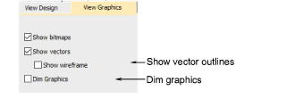
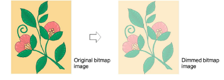

# Image viewing options

|  | Use View > Show Bitmaps to show and hide bitmap images. Right-click to set image display options.   |
| ------------------------------------------ | --------------------------------------------------------------------------------------------------- |
|  | Use View > Show Vectors to show and hide vector graphics. Right-click to set image display options. |
|    | Use View > Dim Artwork to dim graphic backdrops to show stitches more clearly for digitizing.       |

You can dim bitmap image backdrops to make it easier to view stitches. You can also show colored vector graphics as outlines only.

## To set image viewing options...

- Right-click either the Show Bitmap or Show Vectors icon. The Options > View Graphics dialog opens.

- To dim a bitmap image backdrop, select the Dim Graphics checkbox.

- To view a colored vector graphic as outlines, select the Show Wireframe checkbox.

