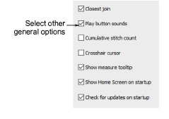

# Other general options

|  | Use Standard > Options to access application options for design view, grid & guides, and other settings. |
| -------------------------------------------- | -------------------------------------------------------------------------------------------------------- |

Miscellaneous other system settings available via the Options > General tab:

These options include:

| Option                      | Function                                                                                                                                                                                                                                                                                  |
| --------------------------- | ----------------------------------------------------------------------------------------------------------------------------------------------------------------------------------------------------------------------------------------------------------------------------------------- |
| Closest join                | The Closest Join method (the default) automatically calculates closest join between objects while digitizing. When deactivated, entry/exit points of all newly digitized objects are set manually. [See Embroidery digitizing for details.](../../Digitizing/input/Embroidery_digitizing) |
| Play button sounds          | Enables beeping sounds made by the software in response to mouse clicks and pressing Enter or Spacebar keys while digitizing.                                                                                                                                                             |
| Cumulative stitch count     | Displays stitch count as a cumulative total in the Stop Sequence tab of the Information docker. [See also View design details in EmbroideryStudio.](../../Basics/view/View_design_details_in_EmbroideryStudio)                                                                            |
| Crosshair cursor            | Changes the default cursor pointer to crosshairs for more precise positioning. It is best used together with the grid.                                                                                                                                                                    |
| Show measure tooltip        | Shows length and angle in a tooltip when measuring distances on screen. [See Measure distances on screen for details.](../../Basics/basics/Measure_distances_on_screen)                                                                                                                   |
| Show Home Screen on startup | When activated, the Home Screen always displays when the software starts up. [See Home screen for details.](../../Basics/basics/Home_screen)                                                                                                                                              |
| Check for updates           | When activated, the software will check at every startup whether updates are available. It will also check whenever you access the My Wilcom page from the Home Screen. When deactivated, you will need to run the Help > Check for Updates command.                                      |

::: tip
Use the measure tooltip in combination with the crosshair cursor on for more accurate measurements.
:::
