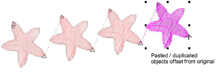
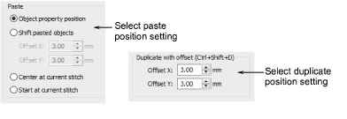

# Paste & duplicate options

|  | Use Standard > Options to access application options for design view, grid & guides, and other settings. |
| -------------------------------------------- | -------------------------------------------------------------------------------------------------------- |

You can control where an object is positioned when pasted. If you are pasting within the same design, the default is the same position from which the object was copied or cut. Other options are available.

Click the Options icon or select Setup > Options and select the Edit tab. Set Paste and Duplicate with offset settings independently of each other as preferred.

Paste settings include:

| Option                   | Function                                                                                              |
| ------------------------ | ----------------------------------------------------------------------------------------------------- |
| Object property position | Objects are pasted according to the coordinates in the Object Properties docker.                      |
| Shift pasted objects     | Objects are pasted slightly offset from their original position. Adjust offset distance as preferred. |
| Center at current stitch | Objects are centered at the current needle position marker.                                           |
| Start at current stitch  | Objects are positioned after the current needle position marker.                                      |

Duplicate position settings apply only to normal Ctrl+Shift+D operations. Cloning by right-click and drag will override these settings temporarily. Ctrl+D operations will assume the ‘quick clone’ value.

::: info Note
Paste and duplicate options control the physical position of the object in the design, not its position in the stitching sequence.
:::

## Related topics...

- [Copy & paste objects](../../Modifying/combine/Copy_paste_objects)
- [Duplicate & clone objects](../../Modifying/combine/Duplicate_clone_objects)
