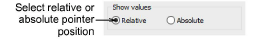
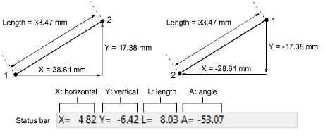
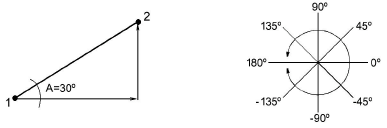

# Pointer position display

|  | Use Standard > Options to access application options for design view, grid & guides, and other settings. |
| -------------------------------------------- | -------------------------------------------------------------------------------------------------------- |

When you move the mouse or digitizer puck, the pointer position is displayed in the Status bar at the bottom of the screen. Use the Options > General tab to display the pointer position as a relative or absolute value.

Select a Relative or Absolute pointer setting:

| Option   | Function                                                                                                                                      |
| -------- | --------------------------------------------------------------------------------------------------------------------------------------------- |
| Relative | Shows pointer position relative to the last digitized point or stitch point. Useful while digitizing or editing stitches.                     |
| Absolute | Shows pointer position as an absolute value from the first needle point of the design. Useful for checking that the design fits a given area. |

The X and Y values show the horizontal and vertical distance of the pointer from the relative or absolute point. The L value is the length of the line connecting two points, while A is the angle of that line, relative to the horizontal. You can measure onscreen distances using the values in the Status Bar. You can also use the Measure function (M).

A negative X value indicates that the second point was placed to the left of the first. A negative Y value displays when the second point is below the first. Negative angles indicate angles of more than 180º – e.g. an angle of -60º is equal to 300º.

## Related topics...

- [Measure distances on screen](../../Basics/basics/Measure_distances_on_screen)
