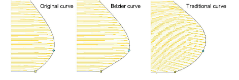

# Reshape options

|  | Right-click Reshape > Reshape Object to set reshaping options. |
| ---------------------------------------------- | -------------------------------------------------------------- |

Stitch generation during reshaping operations can slow down your system. Reshape options let you choose whether stitches are generated immediately or only after Enter is pressed. This tab also controls node dragging behavior in Reshape operations as well as re-sequencing behavior in cutting operations with the Knife tool.

## To set automatic stitch generation options...

- Right-click the Reshape Object icon. The Options > Reshape dialog opens.

- Select options for generating stitches immediately after reshaping operations – i.e. for lettering objects, motif runs, and/or other objects. If left unchecked, any reshaping changes made are not updated until Enter is pressed.
- Select your preferred left mouse drag node behavior – Traditional or Bézier.

Generally, ‘bézier’ node dragging preserves the shape of the curve more closely.

- Select your preferred object-cutting reordering behavior.

EmbroideryStudio orders object fragments resulting from cutting operations with the Knife tool into a closest-join sequence that preserves the source object’s entry and exit points. There are three possible ways of reordering fragment objects:

- Reorder and create travel runs between objects separated by gap.
- Reorder, trimming between separated objects where necessary, but creating no travel runs.
- Combine fragments into a single branched object corresponding to the source object.

The option you choose will affect all Knife tool cutting operations.

Tip: The Break Apart tool allows you to split branched objects, including objects resulting from cutting operations, into their component parts.

## Related topics...

- [Reshape objects with Bézier controls](../../Modifying/reshape/Reshape_objects_with_Bézier_controls)
- [Cut shapes manually](../../Modifying/reshape/Cut_shapes_manually)
- [Break apart composite objects](../../Modifying/reshape/Break_apart_composite_objects)
