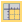
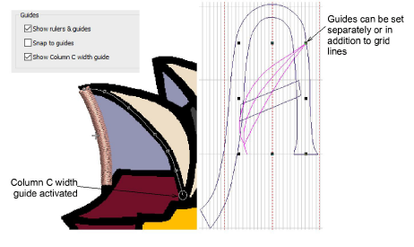

# Ruler & guide display options

|  | Right-click View > Show Rulers & Guides to set the Snap to Grid and Snap to Guides options. |
| -------------------------------------------------------------------- | ------------------------------------------------------------------------------------------- |

Rulers and guides are activated by the Show Rulers & Guides toggle. The unit of measurement – mm or inches – defaults to the regional settings in the MS Windows® Control Panel. The ruler scale adjusts with the current zoom setting. Guides can be used separately or in addition to grid lines for detailed work.

Snap to Guides can be set for guides independently of grid lines. Reference points, control points or leading edges of objects snap to guides during digitizing, sizing, reshaping, or positioning operations. To temporarily disable Snap to Guides as you digitize, hold down Alt.

The Show Column C Width Guide option activates a special cursor with the Column C tool. A circle appears at the cursor position corresponding to the width setting in the Object Properties docker. This is useful when digitizing a border based on a background image. When the offset is biased, two circles are shown, one for each side.

Note: To gain the benefit of the width guide, you must accept the current width setting by pressing Enter, rather than digitizing reference points after finishing the centerline.

## Related topics...

- [Display grids, rulers & guides](../../Basics/basics/Display_grids_rulers_guides)
- [Set measurement units](../../Basics/basics/Set_measurement_units)
- [Digitizing regular columns](../../Digitizing/input/Digitizing_regular_columns)
