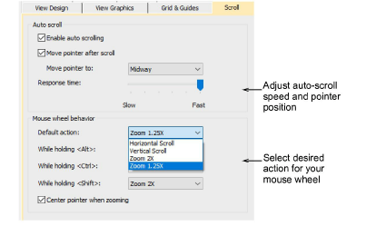

# Scroll options

|  | Use Standard > Options to access application options for design view, grid & guides, and other settings. |
| -------------------------------------------- | -------------------------------------------------------------------------------------------------------- |

The Options > Scroll tab lets you to control mouse pointer and mouse wheel behavior. Use Auto Scroll to scroll automatically while digitizing. This can be more convenient than using panning or scroll bars, especially when working on large designs. The dialog also lets you set four different mouse wheel behaviors.

## To set scroll options...

- Click the Options icon or select Setup > Options and select the Scroll tab.

- Adjust Auto Scroll options as needed. The effect only becomes apparent when you start to digitize. The design window automatically follows the current cursor position.

| Option                                                                                              | Function                                             |
| --------------------------------------------------------------------------------------------------- | ---------------------------------------------------- |
| Auto scroll                                                                                         | Tick to enable automatic scrolling while digitizing. |
| Move pointer after scroll                                                                           | Set pointer position after each scrolling action:    |
| Center: Use this setting for large movements.                                                       |                                                      |
| Midway: Use this setting for smaller movements – e.g. when zooming into a small area of the design. |                                                      |
| Corner: Use this setting for slow scrolling.                                                        |                                                      |
| Response time                                                                                       | Adjust scrolling speed.                              |

Tip: Hold down the Shift key to temporarily deactivate Auto Scroll. Use the Ctrl+Shift+A key combination to toggle Auto Scroll on/off.

- Tick Center pointer when zooming to ensure that the pointer stays centered on screen at all times.
