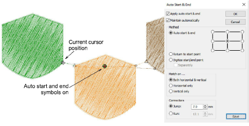

# Show auto-start & end points

The stitch cursor always appears at the end of the last digitized object. On the View Design tab, auto-start & end symbols – a green circle and a red cross – can also be activated.

## Related topics...

- [Setting auto start & end](../../Production/hoops/Setting_auto_start_end)
