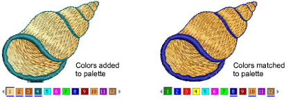
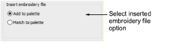

# Thread color handling for inserted files

|  | Use Standard > Options to access application options for design view, grid & guides, and other settings. |
| -------------------------------------------- | -------------------------------------------------------------------------------------------------------- |

Whenever you copy and paste or insert an embroidery design or element from one file to another, the respective color palettes are merged. You have the option of adding the source palette to the target palette or of matching the source palette to the nearest colors in the target palette.

Click the Options icon or select Setup > Options and select the General tab.

Select an inserted embroidery file option:

| Option           | Function                                                                                                                                                             |
| ---------------- | -------------------------------------------------------------------------------------------------------------------------------------------------------------------- |
| Add to palette   | Unique colors in the design are added to the current color palette.                                                                                                  |
| Match to palette | When you insert a design, colors are matched to the current color palette. The system finds the nearest match based first on RGB values, and then on Brand and Code. |
