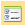
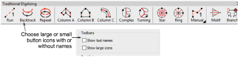

# Toolbar display options

|  | Use Standard > Options to access application options for design view, grid & guides, and other settings. |
| -------------------------------------------- | -------------------------------------------------------------------------------------------------------- |

You can adjust toolbar appearance via the Options > General tab. Choose between large or small button icons, with or without short names.

