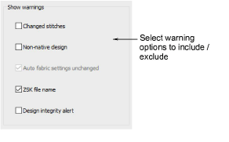
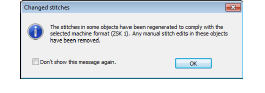
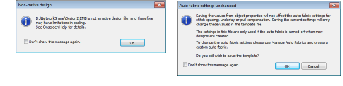
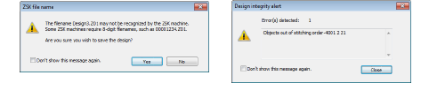

# Warning options

|  | Use Standard > Options to access application options for design view, grid & guides, and other settings. |
| -------------------------------------------- | -------------------------------------------------------------------------------------------------------- |

Some warning messages may become distracting. You may want to switch such warnings off but still be able to re-activate them at a later time. The Options dialog includes a Warnings tab which allows you to re- or de-activate specific warning messages as desired.

Warning messages include:

- Changed Stitches: This appears when sending designs to Stitch Manager, depending on whether stitches need to be regenerated to comply with a changed machine format.

- Non-Native Design: This appears when opening ‘machine files’ of unknown origin. Machine files cannot be scaled by more than approximately ±5% since their stitch count does not change. By contrast, design or ‘outline’ files such as native EMB, can be scaled by any factor as stitches are dynamically regenerated.

- Fabric Settings Unchanged: This appears if you have chosen to work with an auto-fabric and wish to save changes made to object properties. Any changes are saved to the template, not to the fabric itself. Such changes are overridden by current fabric settings.
- ZSK File Name: This appears if you try to save a design to ZSK TC format with an alphanumeric file name. ZSK machines require 8-digit filenames.

- Design Integrity Alert: This appears if the software detects a problem with the design file. If you see an alert, you should use Undo to return the design to an error-free state. Save the design. Then save a separate instance of the design up to the point the alert is generated. Send both designs to Wilcom Support for analysis.

Note: Turning off this message also turns off design integrity checking.

## Related topics...

- [Send designs to Stitch Manager](../../Production/output/Send_designs_to_Stitch_Manager)
- [Working with fabrics](../../Digitizing/properties/Working_with_fabrics)
