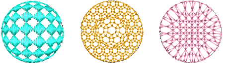

# 3D effects with motif fills

|  | Click Stitch Effects > 3D Warp to apply 3D effects to selected motif fills. Right-click to change settings. |
| -------------------------------- | ----------------------------------------------------------------------------------------------------------- |

Using Globe In with 3D Warp gives a concave effect by increasing motif size and spacing around a center point. Globe Out gives a convex effect by decreasing motif size and spacing. You can apply the effect to an entire object, or to a specified part of the fill.

## Related topics

- [Enveloped motif fills](../../Decorative/motifs/Enveloped_motif_fills)
