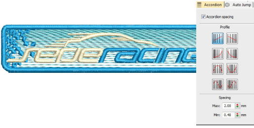

# Accordion spacing

|  | Click Stitch Effects > Accordion Spacing to create perspective and shading effects. Right-click to adjust settings. |
| ---------------------------------------------------- | ------------------------------------------------------------------------------------------------------------------- |

The Accordion Spacing feature varies stitch spacing between dense and open fill, producing gradient and shading effects which are difficult to achieve manually. It provides a simple way to produce variation in a filled pattern and the illusion of depth. It is best used with tatami fill. When applied, current settings – including [Auto Spacing](../../glossary/glossary) and [Fractional Spacing](../../glossary/glossary) – are ignored. However, other settings still apply, including stitch angle. Adjust settings with the Object Properties > Effects > Accordion tab.

## Related topics

- [Gradient stitching](../../Decorative/specialty/Gradient_stitching)
- [Accordion spacing](../../Decorative/specialty/Accordion_spacing)
