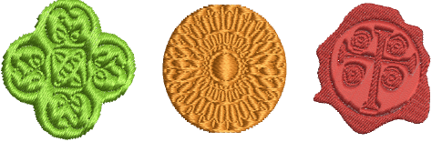

# Apply predefined patterns

|  | Use Docker > Carving Stamp to define a pattern of needle penetrations using a ‘carving stamp’ as a template. |
| -------------------------------------------- | ------------------------------------------------------------------------------------------------------------ |

The Carving Stamp docker contains four tabs: Use Pattern, Use Object, Digitize, and Appearance. The Use Pattern tab lets you select and apply predefined stamp patterns to selected objects. The Use Object tab allows you to select object outlines in the design window for use as a temporary stamp. Selectable objects can include vector graphics. The Digitize tab allows you to digitize custom splits ‘on the fly’. The Appearance tab allows you to soften or intensify the effect.

## Related topics

- [Creating patterns with carving stamps](../../Decorative/patterns/Creating_patterns_with_carving_stamps)
