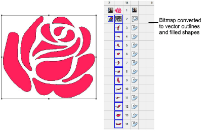

# Auto-trace bitmap artwork

|  | Use Toolbox > Auto-Digitizing > Auto Trace To Vectors to convert artwork to vector objects for conversion to embroidery objects. |
| -------------------------------------- | -------------------------------------------------------------------------------------------------------------------------------- |

Use Auto Trace To Vectors to create [vector](../../glossary/glossary) outlines from [bitmap](../../glossary/glossary#bitmap) images. You can then convert these to embroidery objects using a variety of input methods. Auto Trace To Vectors can find holes in shapes – both inside and outside boundaries are detected.

## Related topics

- [Auto-tracing bitmap artwork](../../Automatic/vectors/Auto-tracing_bitmap_artwork)
