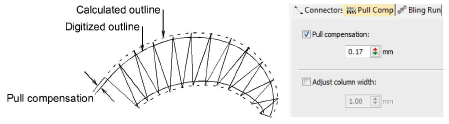

# Automatic pull compensation

|  | Use Stitch Effects > Pull Compensation to automatically compensate for fabric stretch. Right-click for settings. |
| ---------------------------------------------------- | ---------------------------------------------------------------------------------------------------------------- |

Apply automatic pull compensation to objects in your design and adjust as part of your quality checks prior to stitchout. Adjust settings with the Object Properties > Pull Comp tab.

## Related topics

- [Compensating for fabric stretch](../../Quality/underlays/Compensating_for_fabric_stretch)
- [Apply automatic pull compensation](../../Quality/underlays/Apply_automatic_pull_compensation)
- [Adjust column width](../../Quality/underlays/Adjust_column_width)
