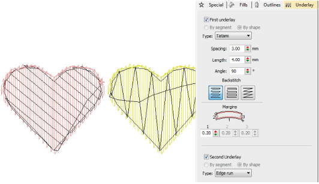

# Automatic underlay

|  | Use Stitch Effects > Auto Underlay to strengthen and stabilize embroidery designs with automatic underlays. Right-click for settings. |
| -------------------------------------------- | ------------------------------------------------------------------------------------------------------------------------------------- |

EmbroideryStudio provides a wide selection of underlay types to choose from. Use a single layer of underlay, or for more support, combine two underlay types. The underlay you choose is determined by the shape and size of object, fabric type, and purpose it is to serve. Adjust settings with the Object Properties > Underlay tab.

## Related topics

- [Stabilizing with automatic underlay](../../Quality/underlays/Stabilizing_with_automatic_underlay)
- [Setting lettering underlay](../../Lettering/lettering_advanced/Setting_lettering_underlay)
