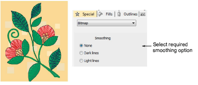

# Bitmap properties

In EmbroideryStudio, every object is comprised of a set of object properties. The Object Properties docker lets you view and edit these. The Special > Bitmap tab lets you smooth light lines or dark lines on the image.

## Related topics

- [Smooth bitmap images](../../Automatic/bitmaps/Smooth_bitmap_images)
